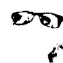

## CORe50 segmentation

* `delete_background_single_image.py`: segmentation for a single image.
* `delete_background_multimages.py:` segmentation for a batch of images.
* `test_trained_svm.py`: this class trains a SVM model for the detection of the hand. You should not really care about this step, since it is already done.

## Usage

Place RGBD depth masks in depth_images and their respective images into the 'images' directory. Then, run `delete_background_multimages.py`.
Results will be stored in the folders **results**, **predilations** and **delations**.

This is what happens to each image:

* First, the background is deleted exploiting depth information. (This step is stored into the `results` folder).
* Then, SVM detects pixels belonging to the hand and tries to remove them. (This step is stored into the `predilations` folder.
* Dilation is applied for denoising the final image. (This step is stored into the `dilations` folder).

### Visual process

| Original image (128x128)        | Deleting the background and the holding hand           | Binary image |Applying dilation  |
| ------------- |:-------------:| -----:| -----: |
|   |  | |  |

## References 📚

* Vincenzo Lomonaco and Davide Maltoni. "CORe50: a new Dataset and Benchmark for Continuous Object Recognition". Proceedings of the 1st Annual Conference on Robot Learning, PMLR 78:17-26, 2017.

* [CORe50 website](https://vlomonaco.github.io/core50/)